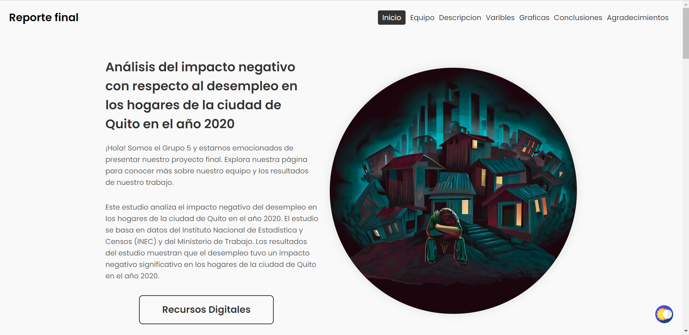
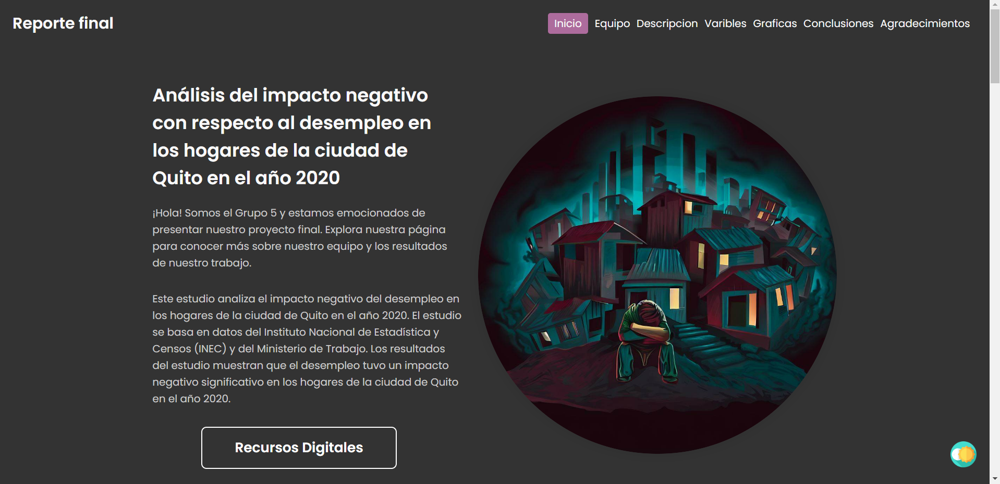

# Data Insights Project

Este es un proyecto de análisis de datos que se enfoca en el impacto negativo del desempleo en los hogares de la ciudad de Quito durante el año 2020. El proyecto utiliza datos del Instituto Nacional de Estadística y Censos (INEC) y del Ministerio de Trabajo para analizar cómo el desempleo afectó a los hogares de la ciudad en términos económicos, sociales y de bienestar.

## Contenido

El repositorio contiene los siguientes archivos y carpetas:

- `index.html`: El archivo HTML que contiene la estructura y contenido de la página web del proyecto.
- `css/`: Una carpeta que contiene varios archivos CSS con estilos para diferentes secciones de la página web. Los estilos tienen adaptación responsive para dispositivos móviles y tablets.
- `js/`: Una carpeta que contiene el archivo JavaScript (`script.js`) con varias funcionalidades interactivas para mejorar la experiencia del usuario en la página web.
- `assets/`: Una carpeta que contiene las imágenes e iconos utilizados en el proyecto.
- `pages/`: Una carpeta que contiene archivos HTML para páginas adicionales relacionadas con el proyecto (por ejemplo, "Recursos Digitales" y "Equipo").
- `README.md`: Este archivo que proporciona información sobre el proyecto y cómo utilizarlo.

## Demo

Puedes ver una demo en línea del proyecto en [https://data-insights-gamma.vercel.app/](https://data-insights-gamma.vercel.app/).

### Tema claro:

### Tema Oscuro:

## Cómo utilizar el proyecto

1. Clona este repositorio en tu máquina local utilizando `git clone`.

2. Abre el archivo `index.html` en tu navegador para ver la página web del proyecto.

3. Navega a través de las diferentes secciones de la página utilizando el menú de navegación en el header. También puedes utilizar el scroll suave para navegar haciendo clic en los enlaces del menú.

4. Explora las gráficas y visualizaciones de datos en la sección "Gráficas". Puedes encontrar ejemplos de "Diagramas de Barras" y "Diagramas de Pastel" creados con Chart.js.

5. En la sección de "Equipo", encontrarás información sobre los miembros del equipo y sus roles en el proyecto.

## Tecnologías utilizadas

- HTML5
- CSS3
- JavaScript (incluyendo bibliotecas externas como Chart.js y Swiper para funcionalidades adicionales)
- Fontawesome (para iconos)
- Swiper (para el carrusel de imágenes)
- Chart.js (para crear las gráficas y visualizaciones estadísticas)

## Contribución

Si deseas contribuir a este proyecto o realizar mejoras, siéntete libre de hacer un fork y enviar un pull request con tus cambios. También puedes abrir un issue para informar sobre errores o sugerir nuevas funcionalidades.

## Licencia

Este proyecto se encuentra bajo la Licencia MIT. Consulta el archivo LICENSE para obtener más detalles.

## Agradecimientos

Agradecemos a todos los miembros del equipo por su dedicación y esfuerzo en la realización de este proyecto. También queremos agradecer a nuestros lectores y supervisores por su interés y apoyo.

